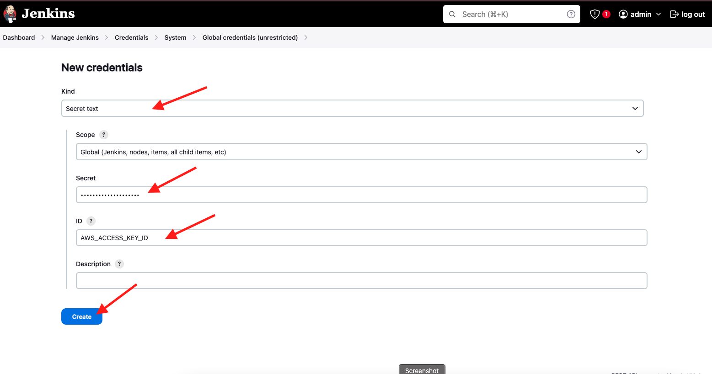
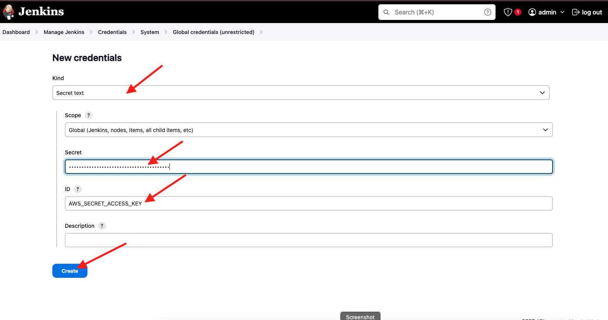
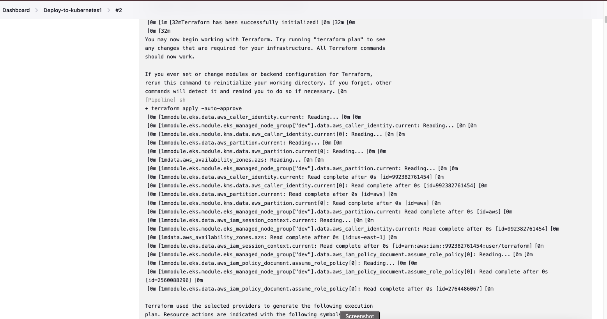

# Deploy-to-Kubernetes-with-Terraform-CI-CD

### CI/CD Pipeline deployment to kubernetes with terraform

In this project we are going configure a CI/CD pipeline that deploys to kubernetes using jenkins. 
Our Infrastructure will be provision by terraform on AWS. Let's explain some of the tools we are using in this project 

 [CI/CD](https://www.synopsys.com/glossary/what-is-cicd.html) stand for continuous integration and continuous delivery/continuous deployment. In very simple terms, CI is a modern software development practice in which incremental code changes are made frequently and reliably. Jenkins is a good and popular CI/CD tools that will be using in this project.

[Kubernetes](https://kubernetes.io/docs/concepts/overview/) is a container management and orchestration tools that automates the deployment, scaling and management of containers. Containers are a good way to bundle and run your applications. In a production environment, you need to manage the containers that run the applications and ensure that there is no downtime. For example, if a container goes down, another container needs to start. Wouldn't it be easier if this behavior was handled by a system? That is where kubernetes comes in. 

[Terraform](https://developer.hashicorp.com/terraform/intro) is an Infrastucture as code (Iac) tools that enable us to write code to create and manage our infrastructure safely and efficiently. Terraform creates and manages resources on cloud platforms and other services through their application programming interfaces (APIs). Providers enable Terraform to work with virtually any platform or service with an accessible API.

This project has 2 directories: 
- [Jenkins-pipeline-deploy-to-eks](https://github.com/Olaminiyi/terraform-code-to-create-jenkins-server): it contains configuration for creating the eks cluster and the jenkinsfile
- [terrafrom-code-to-create-jenkins-server](https://github.com/Olaminiyi/jenkins-pipeline-deploy-to-eks): it contains configuration files for creating the jenkins server 

The project will follow these steps:
1. create a Key Pairs to connect to our AWS account.
2. create an IAM user with programmatic access. Learn how to create it from [here... stop after you using aws configure to configure your aws and continue with this project](https://github.com/Olaminiyi/Project-16). 
3. create S3
4. Create jenkins server configuration with terraform. The foolowing will be installed on the jenkins server through **user-data** using `jenkins-server-script.sh` 
    - Jenkins
    - git
    - terraform 
    - kubectl
[Kubectl](https://www.getambassador.io/blog/what-is-kubectl) is a command line tool used to run commands against Kubernetes clusters. It does this by authenticating with the Master Node of your cluster and making API calls to do a variety of management actions.. we need it inside the jenkin server when we want to deploy application to kubernetes inside the `jenkinsfile`.

5. Run terraform init, plan and apply to create the jenkin-server on AWS
6. check the resource on the aws console

7. Then we move to the Jenkins-pipeline-deploy-to-eks directory and push to a git repo
8. configure the Jenkins and connect  it with github repo that contains the eks and Jenkinsfile configuration.


### Create a keypair

Login to the aws console to create a keypair

We are using us-east-1


### Add your pem key to your local machine

open a new terminal, go to the directory where your pem key was downloaded, mine is document.

make your keypair executable using this command
```
chmod 400 jenkins-server.pem
```
Add the keypair identity to your computer
```
ssh-add jenkins-server.pem
```
check if the key has been added successfully
```
ssh-add -l
```


Let's check what we have in the **terrafrom-code-to-create-jenkins-server**

**vpc.tf** contains the vpc, subnet, internet-gateway, route-table and security-group(contains ingress and egress) and configurations.

```
resource "aws_vpc" "myapp-vpc" {
  cidr_block = var.vpc_cidr_block
  tags = {
    Name = "${var.env_prefix}-vpc"
  }
}

resource "aws_subnet" "myapp-subnet-1" {
  vpc_id            = aws_vpc.myapp-vpc.id
  cidr_block        = var.subnet_cidr_block
  availability_zone = var.avail_zone
  tags = {
    Name = "${var.env_prefix}-subnet-1"
  }
}

resource "aws_internet_gateway" "myapp-igw" {
  vpc_id = aws_vpc.myapp-vpc.id
  tags = {
    Name = "${var.env_prefix}-igw"
  }
}

resource "aws_default_route_table" "main-rtb" {
  default_route_table_id = aws_vpc.myapp-vpc.default_route_table_id
  route {
    cidr_block = "0.0.0.0/0"
    gateway_id = aws_internet_gateway.myapp-igw.id
  }
  tags = {
    Name = "${var.env_prefix}-main-rtb"
  }
}

resource "aws_default_security_group" "default-sg" {
  vpc_id = aws_vpc.myapp-vpc.id
  ingress {
    from_port   = 22
    to_port     = 22
    protocol    = "tcp"
    cidr_blocks = ["0.0.0.0/0"]
  }
  ingress {
    from_port   = 8080
    to_port     = 8080
    protocol    = "tcp"
    cidr_blocks = ["0.0.0.0/0"]
  }
  egress {
    from_port   = 0
    to_port     = 0
    protocol    = "-1"
    cidr_blocks = ["0.0.0.0/0"]
  }
  tags = {
    Name = "${var.env_prefix}-default-sg"
  }
}
```

**jenkins-server.tf** contains the following configuration that create the `myapp-server instamnce` which is the jenkins server from a latest amazon linux image `amzn2-ami-hvm-*-x86_64-gp2`. The user data use the `jenkins-server-script.sh` to configure the instance.

```
data "aws_ami" "latest-amazon-linux-image" {
  most_recent = true
  owners      = ["amazon"]
  filter {
    name   = "name"
    values = ["amzn2-ami-hvm-*-x86_64-gp2"]
  }
  filter {
    name   = "virtualization-type"
    values = ["hvm"]
  }
}

resource "aws_instance" "myapp-server" {
  ami                         = data.aws_ami.latest-amazon-linux-image.id
  instance_type               = var.instance_type
  key_name                    = "jenkins-server"
  subnet_id                   = aws_subnet.myapp-subnet-1.id
  vpc_security_group_ids      = [aws_default_security_group.default-sg.id]
  availability_zone           = var.avail_zone
  associate_public_ip_address = true
  user_data                   = file("jenkins-server-script.sh")
  tags = {
    Name = "${var.env_prefix}-server"
  }
}
```
**jenkins-server-script.sh** contains the script to configure myapp-server. It install terraform, git, kubectl and jenkins on the instance

```
#!/bin/bash

# install jenkins

sudo yum update
sudo wget -O /etc/yum.repos.d/jenkins.repo \
    https://pkg.jenkins.io/redhat-stable/jenkins.repo
sudo rpm --import https://pkg.jenkins.io/redhat-stable/jenkins.io.key
sudo yum upgrade -y
sudo amazon-linux-extras install java-openjdk11 -y
sudo yum install jenkins -y
sudo systemctl enable jenkins
sudo systemctl start jenkins

# install git
sudo yum install git -y

# install terraform

sudo yum install -y yum-utils
sudo yum-config-manager --add-repo https://rpm.releases.hashicorp.com/AmazonLinux/hashicorp.repo
sudo yum -y install terraform

# install kubectl

sudo curl -LO https://storage.googleapis.com/kubernetes-release/release/v1.23.6/bin/linux/amd64/kubectl
sudo chmod +x ./kubectl
sudo mkdir -p $HOME/bin && sudo cp ./kubectl $HOME/bin/kubectl && export PATH=$PATH:$HOME/bin
```
**backend.tf** contains the configuration for the backend which stores our state file in s3

```
terraform {
  backend "s3" {
    bucket = "myOla-app2"
    region = "us-east-1"
    key = "jenkins-server/terraform.tfstate"
  }
}
```

**provider.tf** which contains our provider
```
terraform {
  required_providers {
    aws = {
      source  = "hashicorp/aws"
      version = "4.52.0"
    }
  }
}

provider "aws" {
  region = "us-east-1"
}
```
change into terraform-code-to-create-jenkins-server directory
```
cd terraform-code-to-create-jenkins-server
```
run 
```
terraform init
```
```
terraform validate
```
```
terraform plan
```
```
terraform apply
```


check on the aws console for the resources created 


### configure the Jenkins and connect it with github and aws

Connect to the Jenkins in your web browser using the 
```
<public ip address>:8080
```
ssh into the Jenkins(dev-server) on your git bash/cmd or terminal you are using, use this command
```
ssh -i <your-key.pem> ec2@<dev-server-public-ip-address>
```

confirm if you've configured aws with your AWS access key
```
aws configure
```


Get the Administrator password
```
sudo cat /var/lib/jenkins/secrets/initialAdminPassword
```


### Add your credentials


Add your github username and password


Add your AWS ACCESS KEY ID and AWS secret access key






Go to the dashboard


**click ok**


**Change working directory to the jenkins-pipeline-deploy-to-eks**

```
jenkins-pipeline-deploy-to-eks
```

we have 2 folders inside this directory and a very important file Jenkinsfile:
1. kubernetes: this contains nginx-deployment.yaml and nginx-service.yaml files for deploying nginx service into our cluster after its creation using kubectl

**nginx-deployment.yaml**
```
apiVersion: apps/v1
kind: Deployment
metadata:
  name: nginx
spec:
  selector:
    matchLabels:
      app: nginx
  replicas: 1
  template:
    metadata:
      labels:
        app: nginx
    spec:
      containers:
      - name: nginx
        image: nginx
        ports:
        - containerPort: 80
```

**nginx-service.yaml**
```
apiVersion: v1
kind: Service
metadata:
  name: nginx
  labels:
    app: nginx
spec:
  ports:
  - name: http
    port: 80
    protocol: TCP
    targetPort: 80
  selector:
    app: nginx
  type: LoadBalancer
```

2. terraform folder:  contains the terraform configuration for creating kubernetes cluster on aws
3. Jenkinsfile:  the jenkins tools installed on the Jenkins server(dev-server) will pickup to run our pipeline. This file contains the stages that CI/CD automation will go through to create our cluster and deploy the nginx application on it.

```
#!/usr/bin/env groovy
pipeline {
    agent any
    environment {
        AWS_ACCESS_KEY_ID = credentials('AWS_ACCESS_KEY_ID')
        AWS_SECRET_ACCESS_KEY = credentials('AWS_SECRET_ACCESS_KEY')
        AWS_DEFAULT_REGION = "us-east-1"
    }
    stages {
        stage("Create an EKS Cluster") {
            steps {
                script {
                    dir('terraform') {
                        sh "terraform init"
                        sh "terraform apply -auto-approve"
                    }
                }
            }
        }
        stage("Deploy to EKS") {
            steps {
                script {
                    dir('kubernetes') {
                        sh "aws eks update-kubeconfig --name myapp-eks-cluster"
                        sh "kubectl apply -f nginx-deployment.yaml"
                        sh "kubectl apply -f nginx-service.yaml"
                    }
                }
            }
        }
    }
}
```


**Check the console output**





**check the resources created**


**Remember to destroy the infrastructure**
```
terraform destroy --auto-approve
```
